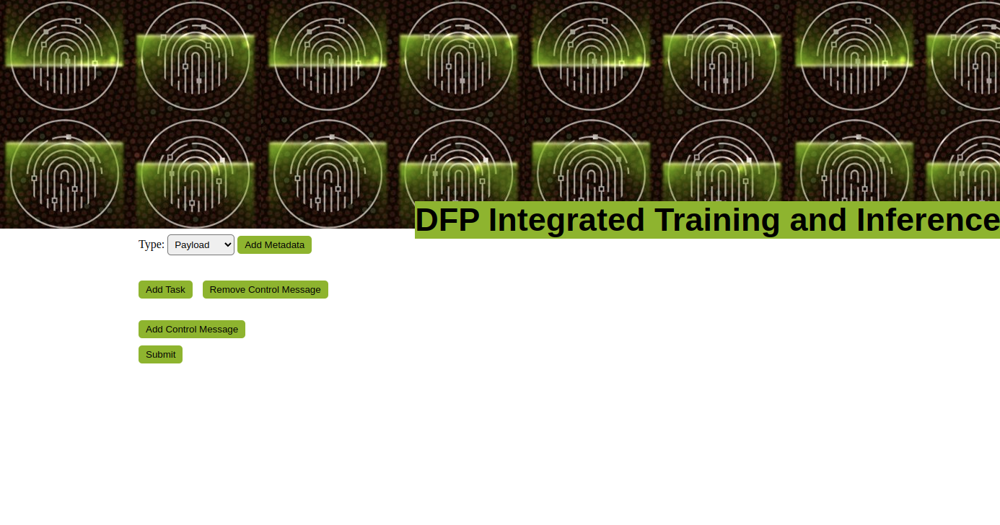
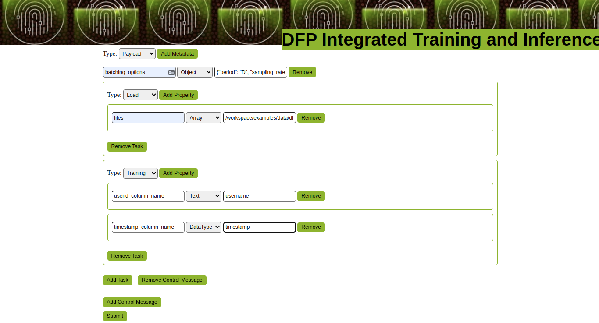
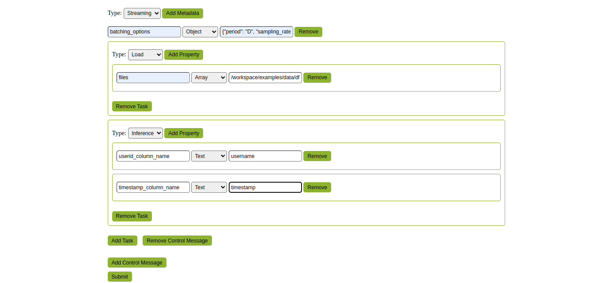

<!--
SPDX-FileCopyrightText: Copyright (c) 2023-2024, NVIDIA CORPORATION & AFFILIATES. All rights reserved.
SPDX-License-Identifier: Apache-2.0

Licensed under the Apache License, Version 2.0 (the "License");
you may not use this file except in compliance with the License.
You may obtain a copy of the License at

http://www.apache.org/licenses/LICENSE-2.0

Unless required by applicable law or agreed to in writing, software
distributed under the License is distributed on an "AS IS" BASIS,
WITHOUT WARRANTIES OR CONDITIONS OF ANY KIND, either express or implied.
See the License for the specific language governing permissions and
limitations under the License.
-->

# Multi Control Message GUI

## Introduction
This document provides a comprehensive guide on how to use a Control Messages Submission GUI for digital fingerprinting workflow. With this GUI, users can create and submit control messages to a Kafka topic for load, training, inference of a digital fingerprinting workflow. The GUI provides extensive options for control message creation, such as adding multiple tasks, configuring key-value parameters at task and control message levels, and also provides option for selecting the data type (payload or streaming). In addition, users can easily remove tasks and submit multiple control messages with just a click. By the end of this document, you will have a working Control Messages Submission GUI that will enhance your digital fingerprinting workflow usage experience.

## Home
The UI will look like a dynamic form with various buttons and input fields that allow the user to specify their own metadata, tasks, and properties. The form will then generate a control message. This GUI will allow the user to create any number of control messages with metadata and tasks with their own properties.


By clicking on the `Add Control Message` button adds a new control message to the form. Each control message has a type selector and three buttons, one to add metadata properties, to add task and the other to remove control message.


- `Type`: A user may select a control message of either the `streaming` or `payload` kind. In the backend digital fingerprinting workflow handles the message in accordance with the type provided.
- `Add Metadata`: button adds a new metadata section to the control message. Each metadata section has a key selector, a data type selector, a value input field, and a `Remove` button.
- `Add Task`: button adds a new task section to the control message. Each task section has a type selector, a `Properties` section, and a `Remove` button.
  - `Add Property`: button inside the `Properties` section adds a new property to the task. Each property has a key input field, a data type selector, a value input field, and a `Remove` button.


## Example
Let's just create an example with some digital fingerprinting pipeline properties and generate multiple control messages.

**Note**: By default DataType is set to `Text`. If the DataType is set to `Array`, string with commas in the value field will be converted to an array. Similar to this, a dictionary will be created from a JSON string whose DataType is set to an `Object`.

### Control Message Training

How to construct the control message for training with the following parameters is shown below.

  - Metadata Properties:
    - `Type` (Selector): `payload`
    - `batching_options` (Object): `{"period": "D", "sampling_rate_s": 0, "start_time": "2023-03-01", "end_time": "2023-03-23"}`
  - Task Properties:
    - `Type` (Selector): `Load`
    - `files` (Array): ```/workspace/examples/data/dfp/duo-training-data/*.json```
  - Task Properties:
    - `Type` (Selector): `Training`
    - `userid_column_name` (Text): ```username```
    - `timestamp_column_name` (Text): ```timestamp```



### Control Message Inference

How to construct the control message for inference with the following parameters is shown below..

  - Metadata Properties:
    - `Type` (Selector): `streaming`
    - `batching_options` (Object): `{"period": "D", "sampling_rate_s": 0, "start_time": "2023-03-01", "end_time": "2023-03-23"}`
  - Task Properties:
    - `Type` (Selector): `Load`
    - `files` (Array): ```/workspace/examples/data/dfp/duo-inference-data/*.json```
  - Task Properties:
    - `Type` (Selector): `Inference`
    - `userid_column_name` (Text): ```username```
    - `timestamp_column_name` (Text): ```timestamp```




#### Submit

Response to a user submitted action as shown below.


The list of control messages that the GUI ultimately generates is shown below.
```json
{
  "inputs": [
    {
      "metadata": {
        "batching_options": {
          "period": "D",
          "sampling_rate_s": 0,
          "start_time": "2023-03-01",
          "end_time": "2023-03-23"
        },
        "data_type": "payload"
      },
      "tasks": [
        {
          "type": "load",
          "properties": {
            "files": [
              "/workspace/examples/data/dfp/duo-training-data/*.json"
            ]
          }
        },
        {
          "type": "training",
          "properties": {
            "userid_column_name": "username",
            "timestamp_column_name": "timestamp"
          }
        }
      ]
    },
    {
      "metadata": {
        "batching_options": {
          "period": "D",
          "sampling_rate_s": 0,
          "start_time": "2023-03-01",
          "end_time": "2023-03-23"
        },
        "data_type": "streaming"
      },
      "tasks": [
        {
          "type": "load",
          "properties": {
            "files": [
              "/workspace/examples/data/dfp/duo-inference-data/*.json"
            ]
          }
        },
        {
          "type": "inference",
          "properties": {
            "userid_column_name": "username",
            "timestamp_column_name": "timestamp"
          }
        }
      ]
    }
  ]
}
```
